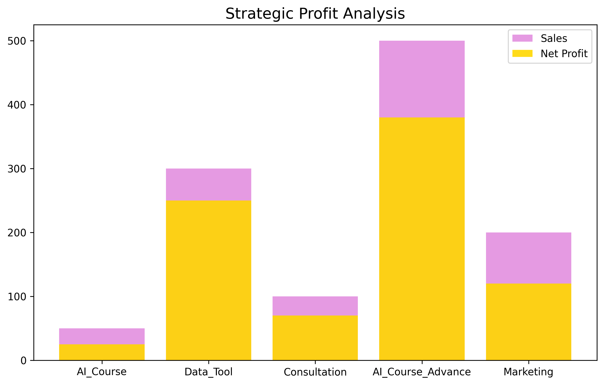

# 🚀 Strategic Profit Analysis & Sales Forecasting (Python)

In this project, I act as a **Data Analyst** to transform raw financial data into actionable decision-making tools for management.

## 🌟 Strategic Impact:
* **Automation:** Streamlined the profit calculation process, reducing manual labor from hours to seconds.
* **Prescriptive Analytics:** Identified high-efficiency products to optimize marketing budget allocation.
* **Future Forecasting:** Leveraged mathematical models to project sales for the next 3 months with high accuracy.

## 📊 Visual Insights:

*(Upload your gold and orchid chart here)*
  
